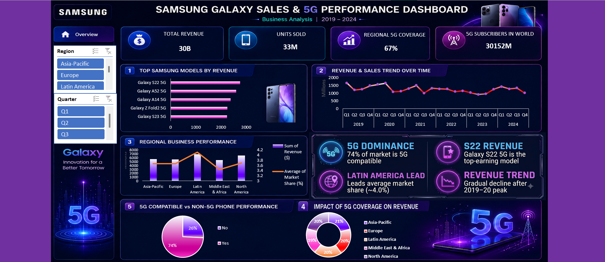
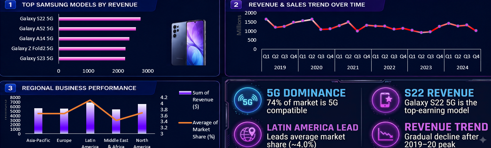
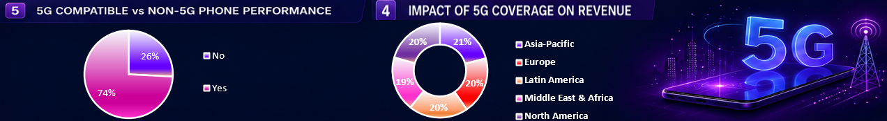

# 📱 Samsung Galaxy Sales & 5G Performance Dashboard

<p align="center">
  
</p>

<h3 align="center">Business Analysis of Samsung Galaxy Sales, Revenue & 5G Performance | 2019–2024</h3>

<p align="center">
  
  
  
  
</p>

---

## 📌 Project Overview

The **Samsung Galaxy Sales & 5G Performance Dashboard** is an interactive business-analysis project designed to examine Samsung's smartphone sales performance, revenue trends, regional performance, 5G adoption, and model-level contribution between **2019 and 2024**.

The dashboard combines key performance indicators, product-level analysis, regional comparisons, time-series trends, and 5G-related metrics into a single executive-style view.

The primary goal is to transform sales and market information into **clear, decision-oriented insights** that can help stakeholders understand:

- 📈 Revenue and sales movement over time
- 📱 Top-performing Samsung Galaxy models
- 🌍 Regional business performance
- 📡 5G coverage and adoption
- 💰 The relationship between 5G coverage and revenue
- 🔎 Differences between 5G-compatible and non-5G devices

---

## 🎯 Project Objectives

1. Analyze Samsung Galaxy sales and revenue performance from **2019–2024**.
2. Identify the Samsung Galaxy models contributing the most revenue.
3. Compare business performance across major geographical regions.
4. Examine quarterly revenue and sales trends.
5. Understand the role of **5G compatibility** in phone performance.
6. Compare regional 5G coverage with revenue contribution.
7. Build an executive-friendly dashboard that communicates insights quickly.

---

## 🖼️ Dashboard Preview

### Full Dashboard

<p align="center">
  
</p>

### KPI Cards

<p align="center">
  
</p>

The headline KPIs displayed in the dashboard are:

| KPI | Dashboard Value |
|---|---:|
| 💰 Total Revenue | **30B** |
| 📱 Units Sold | **33M** |
| 📡 Regional 5G Coverage | **67%** |
| 🌐 5G Subscribers in World | **30,152M** |

> **Note:** KPI values above are reproduced as displayed in the supplied dashboard artwork. They are not independently verified against an external Samsung dataset.

---

## 📊 Dashboard Sections

### 1️⃣ Top Samsung Models by Revenue

<p align="center">
  
</p>

The dashboard highlights the following models among the top revenue-generating Samsung Galaxy products:

- **Galaxy S22 5G**
- **Galaxy A52 5G**
- **Galaxy A14 5G**
- **Galaxy Z Fold2 5G**
- **Galaxy S23 5G**

The visualization makes it easy to compare the relative revenue contribution of the featured models.

---

### 2️⃣ Revenue & Sales Trend Over Time

The quarterly trend visualization covers **2019 through 2024** and helps identify:

- Quarterly peaks and declines
- Year-to-year movement
- Changes in sales/revenue momentum
- Periods of stronger and weaker performance

The dashboard also visually indicates a **higher-performance period around 2019–2020**, followed by fluctuations and a broader decline in later periods.

---

### 3️⃣ Regional Business Performance

The regional analysis compares business performance across:

- 🌏 Asia-Pacific
- 🇪🇺 Europe
- 🌎 Latin America
- 🌍 Middle East & Africa
- 🌎 North America

The chart combines:

- **Revenue** as a column measure
- **Average market share** as a line measure

This dual-axis view allows revenue scale and market-share movement to be reviewed together.

---

### 4️⃣ Impact of 5G Coverage on Revenue

The dashboard includes a regional 5G/revenue comparison using a donut visualization.

Displayed regional shares are approximately:

| Region | Share shown |
|---|---:|
| Asia-Pacific | **21%** |
| Europe | **20%** |
| Latin America | **20%** |
| Middle East & Africa | **19%** |
| North America | **20%** |

The distribution is relatively balanced across the displayed regions, with Asia-Pacific having the largest displayed share.

---

### 5️⃣ 5G-Compatible vs Non-5G Phone Performance

The dashboard shows:

- **74%** — 5G-compatible
- **26%** — Non-5G

This visualization provides a high-level view of the product mix represented in the dashboard and emphasizes the importance of 5G-capable devices within the analyzed portfolio.

---

## 💡 Key Business Insights

### 📡 1. Strong 5G Representation

A large share of the phone portfolio shown in the dashboard is **5G-compatible (74%)**, indicating that 5G devices form a major component of the analyzed product mix.

### 📱 2. Galaxy S22 5G Leads the Featured Models

Among the models displayed in the revenue ranking, **Galaxy S22 5G** has the longest revenue bar and is highlighted by the dashboard as the top-earning model.

### 🌎 3. Latin America Shows Strong Market-Share Performance

The regional chart shows **Latin America** with the highest average market-share line value among the regions displayed.

### 📈 4. Revenue Performance Is Uneven Over Time

The quarterly trend contains several peaks and declines rather than a continuously increasing pattern. The dashboard highlights a stronger period around **2019–2020**, followed by a gradual decline with subsequent fluctuations.

### 🌐 5. Regional Revenue Contribution Is Broadly Distributed

The 5G coverage/revenue donut shows regional contributions clustered around approximately **19%–21%**, suggesting no single region dominates the displayed distribution.

---

## 🔍 Executive Summary

| Area | Observation |
|---|---|
| Total Revenue | **30B** displayed |
| Units Sold | **33M** displayed |
| 5G Coverage | **67%** displayed |
| 5G-Compatible Portfolio | **74%** displayed |
| Leading Featured Model | **Galaxy S22 5G** |
| Strongest Average Market Share | **Latin America** |
| Time Period | **2019–2024** |
| Primary Analysis | Sales, revenue, regions & 5G |

---

## 🧠 Business Questions Answered

This dashboard is designed to answer questions such as:

> **Which Samsung Galaxy models generate the most revenue?**

> **How have revenue and sales changed quarter by quarter from 2019 to 2024?**

> **Which regions contribute strongly to Samsung's business performance?**

> **What percentage of the analyzed phones are 5G-compatible?**

> **How is 5G coverage distributed across regions?**

> **What relationship can be observed between 5G adoption and revenue performance?**

---

## 🛠️ Skills Demonstrated

This project demonstrates practical skills in:

- 📊 Business Intelligence & Dashboard Design
- 🧮 KPI Development
- 🗃️ Data Analysis
- 🧠 Business Insight Generation
- 📈 Trend Analysis
- 🌍 Regional Performance Analysis
- 📱 Product/Model Performance Analysis
- 📡 5G Market Analysis
- 🎨 Executive Dashboard Storytelling
- 🧾 SQL-oriented analytical thinking

---

## 📁 Repository Structure

```text
Samsung-Galaxy-Sales-5G-Dashboard/
│
├── README.md
│
└── images/
    ├── dashboard_overview.png
    ├── kpi_cards.png
    ├── performance_sections.png
    └── insights_5g_coverage.png
```

---

## 🖼️ Additional Dashboard Visuals

### Performance Analysis

<p align="center">
  
</p>

### 5G Coverage & Portfolio Analysis

<p align="center">
  
</p>

---

## 📌 Methodology

The dashboard follows a business-analysis workflow:

```text
Raw Sales / Market Data
        ↓
Data Cleaning & Preparation
        ↓
Metric & KPI Development
        ↓
Product & Regional Analysis
        ↓
5G Segmentation
        ↓
Trend Analysis
        ↓
Interactive Dashboard
        ↓
Business Insights
```

The analysis focuses on four major dimensions:

**Time × Product × Region × 5G**

This structure enables the dashboard to move from high-level KPIs to detailed product, regional, and technology insights.

---

## 🚀 How to Use This Repository

1. Download or clone this repository.
2. Open `README.md` to view the project documentation.
3. Open the `images` folder to explore the dashboard visuals.
4. If the original BI/dashboard file is added later, open it using the relevant BI software.
5. Use the dashboard filters to explore different regions, quarters, models, and 5G-related metrics.

---

## 📷 GitHub README Preview

GitHub automatically renders the images in this README because they are stored using relative paths:

```markdown

```

This means the repository can be uploaded directly without changing the image paths.

---

## 📈 Potential Future Enhancements

Future versions of this project could include:

- 📅 Monthly-level sales analysis
- 💵 Average selling price (ASP)
- 🏆 Market-share ranking by model
- 📱 Model lifecycle analysis
- 📡 5G adoption growth by year
- 🌍 Country-level performance
- 💰 Profit and margin analysis
- 📊 Forecasting of future sales
- 🔎 Customer-segment analysis
- ⚡ Automated data refresh pipeline

---

## ⚠️ Data Note

This repository documents the dashboard visuals supplied for the project. Values and observations in this README are based on what is visibly presented in those dashboard images.

For production or portfolio use, the underlying dataset, transformation logic, and metric definitions should be included alongside the dashboard so that every KPI can be independently reproduced.

---

## 👨‍💻 Author

### **Jay Meena**

**Business Intelligence | Data Analytics | SQL | Dashboard Development**

This project demonstrates the use of data visualization and analytical storytelling to turn Samsung Galaxy sales and 5G-related metrics into an executive-friendly business dashboard.

---

## ⭐ If You Find This Project Useful

If this project helped you understand dashboard design, business analysis, or 5G market insights:

- ⭐ Star the repository
- 🍴 Fork the project
- 💬 Share feedback
- 🔗 Connect with the author

---

<p align="center">
  <b>📱 Samsung Galaxy Sales & 5G Performance Dashboard</b><br>
  <i>Turning sales data into business insights.</i>
</p>
